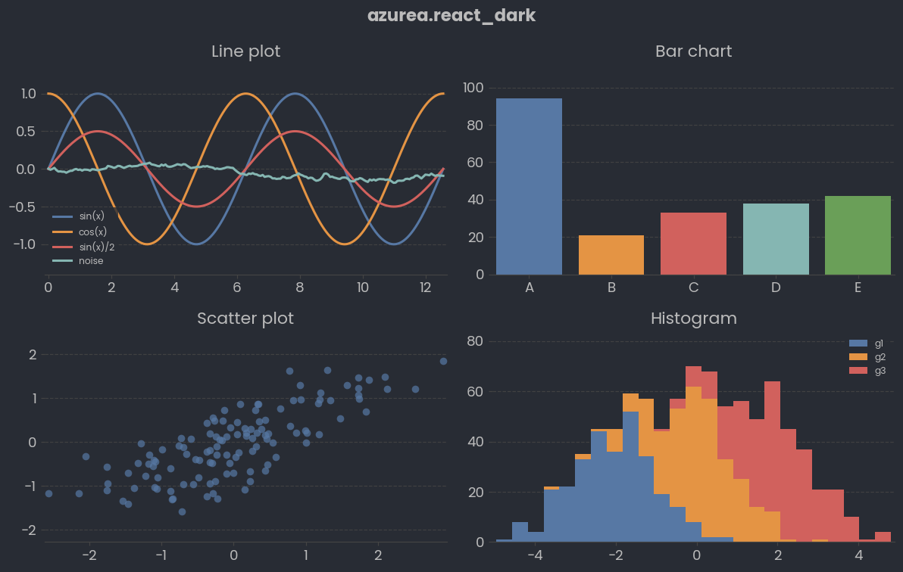
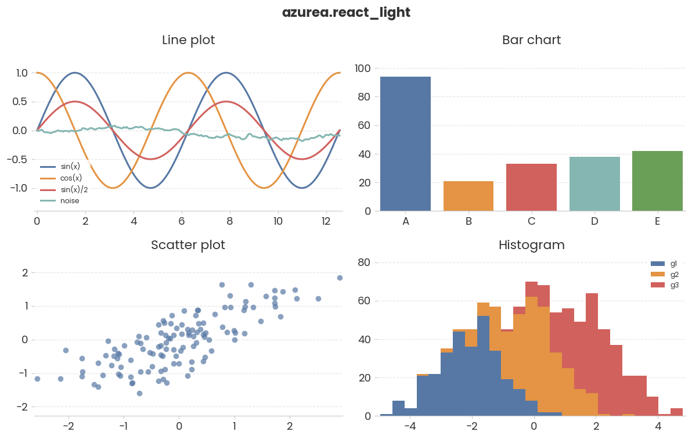

# azurea

Matplotlib themes by **azuka** — dark & light plotting styles with a bundled Poppins font and a hand-picked color palette.

[](https://pypi.org/project/azurea/)
[](https://pypi.org/project/azurea/)
[](#license)

## Install

From PyPI:

```bash
pip install azurea
```

Upgrade:

```bash
pip install --upgrade azurea
```

Or from GitHub:

```bash
pip install git+https://github.com/azkarohbiya/azurea.git
```

## Quick start

```python
import azurea
import matplotlib.pyplot as plt
import numpy as np

azurea.use("react_dark")   # or "react_light"

x = np.linspace(0, 4 * np.pi, 200)
plt.plot(x, np.sin(x), label="sin(x)")
plt.plot(x, np.cos(x), label="cos(x)")
plt.legend()
plt.show()
```

You can also apply the style the standard matplotlib way:

```python
import azurea  # registers styles + fonts
import matplotlib.pyplot as plt

plt.style.use("azurea.react_dark")   # or "azurea.react_light"
```

## Available styles

```python
azurea.available()
# ['azurea.react_dark', 'azurea.react_light']
```

| Name | Background | Use case |
|---|---|---|
| `azurea.react_dark`  | `#282c34` | dark-mode dashboards, notebooks |
| `azurea.react_light` | `#FFFFFF` | reports, print, docs |

Both share the Poppins typeface (bundled — no manual font install needed) and a React-inspired palette led by `#0472f7` blue, `#06b45e` green, `#fc3d51` red.

## Samples

### Dark mode — `azurea.react_dark`



### Light mode — `azurea.react_light`



## Custom color palette

`azurea.custom_colors` is a curated list of 23 hex colors you can use directly:

```python
import azurea
import matplotlib.pyplot as plt

azurea.use("react_light")
plt.bar(["A", "B", "C", "D", "E"], [30, 55, 42, 78, 60],
        color=azurea.custom_colors[:5])
plt.show()
```

## Test notebook

See [`test_azurea.ipynb`](test_azurea.ipynb) for a full demo covering line, bar, scatter, and histogram plots in both modes, plus the color palette.

## License

MIT © azuka
